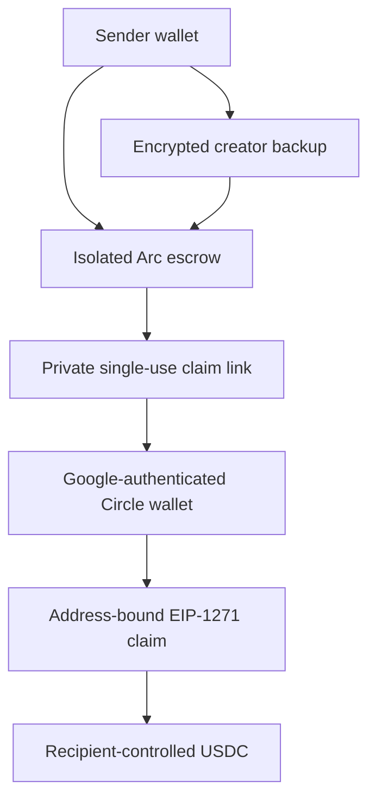

# Arc PayLink v3.1

Arc PayLink lets a sender fund an isolated USDC escrow on Arc and deliver a private, single-use claim link to someone who does not already have a crypto wallet. The recipient signs in with Google, creates or recovers a user-controlled Circle smart account, claims the exact payment, and can then use the USDC from the recipient wallet.

**Live mainnet pilot:** [arc-paylink-two.vercel.app](https://arc-paylink-two.vercel.app)

## What is verified

The production build has completed a real Arc mainnet acceptance flow with `0.01 USDC`:

- sender wallet connection, isolated escrow creation, and exact funding;
- private claim-link handoff to a different Google account;
- Circle wallet creation and smart-account deployment;
- address-bound authorization and EIP-1271 claim;
- claimed balance displayed from Arc in `/wallet`;
- recipient USDC transfer preparation, review, approval, submission, and balance reconciliation;
- encrypted creator backup and recovery in a clean browser;
- recovered PayLink status revalidated from Arc as `CLAIMED`.

The application and contract test suites, lint, TypeScript checks, and production build are run before deployment. Detailed deployment and security records are in [`docs/`](./docs).

## Product flow

### Sender

1. Open `/create` and connect a funded Arc wallet.
2. Enter a title, recipient email, exact USDC amount, reference, and expiry.
3. Review and sign escrow creation and funding in the wallet.
4. Copy the private claim link and deliver it only to the intended recipient.
5. Track the PayLink from `/requests` and save its encrypted creator backup.

### Recipient

1. Open the private `/claim#claim=…` link.
2. Sign in with the intended Google account.
3. Create or recover the user-controlled Circle wallet.
4. Review and approve wallet deployment, claim authorization, and the final claim.
5. Open `/wallet` with the same Google account to view or send the received USDC.

### Creator recovery

In a new browser, the original sender can open `/requests`, enter the payment ID, reconnect the original wallet, and sign a payment-specific recovery message. The encrypted claim secret is decrypted only in that browser, and the recovered record is revalidated against Arc. Recovery itself moves no funds.

## Architecture



- `ArcPayLinkFactory` creates one deterministic minimal-proxy escrow per payment.
- Each escrow is locked to official Arc USDC, an exact amount, expiry, and hashed link secret.
- The claim signature binds the recipient wallet address, so possession of the link alone cannot redirect funds.
- Each PayLink can be claimed once. After expiry, refund behavior is sender-controlled according to the deployed escrow version.
- Creator records are stored without plaintext claim secrets; recovery uses wallet-signed, payment-specific key derivation.
- Claim secrets remain in the URL fragment and are not included in HTTP requests.

## Mainnet deployment

| Item | Value |
| --- | --- |
| Network | Arc mainnet (`5042`) |
| USDC | `0x3600000000000000000000000000000000000000` |
| Factory | `0x19fbf0B85e66d68D312cD18D04A1a789107387FF` |
| Implementation | `0xc90d21bDfcbA415ea9Ca15B3873C7E95Ac05d465` |
| Deployment transaction | [`0x737e…c4c7f`](https://explorer.arc.io/tx/0x737e467a112113d987ca0f845f256d73a1aa9f82c76655f87450898866cf4c7f) |

Machine-readable deployment evidence: [`deployments/arc-mainnet-escrow.json`](./deployments/arc-mainnet-escrow.json).

## Security boundary

- Arc PayLink never asks for or receives a private key or seed phrase.
- The claim URL is a bearer secret and must be sent only to the intended recipient.
- The recipient email is an offchain delivery constraint; it is not written onchain.
- Circle secures the recipient wallet and presents explicit approvals.
- The server verifies trusted factory, escrow, token, payment ID, amount, expiry, secret hash, funded state, and wallet ownership before preparing a claim.
- Mutable JSON APIs enforce origin/content-type/body-size controls; production API writes are protected by a Vercel rate-limit rule.
- Recovery and status reconciliation do not automatically retry, refund, top up, or otherwise move funds.

See [`docs/security-privacy-threat-model.md`](./docs/security-privacy-threat-model.md) for the full threat boundary.

## Local development

Requirements: Node.js 20.9 or newer.

```bash
npm install
cp .env.example .env.local
npm run dev
```

Quality checks:

```bash
npm run lint
npm test
npx tsc --noEmit
npm run build
```

The default configuration is Arc testnet. Mainnet requires explicit environment configuration; contract deployment scripts also require their dedicated confirmation latch.

## Evidence and preserved history

- Mainnet pilot: [`docs/mainnet-microgrants-evidence.md`](./docs/mainnet-microgrants-evidence.md)
- Security and privacy: [`docs/security-privacy-threat-model.md`](./docs/security-privacy-threat-model.md)
- Product-readiness record: [`docs/product-readiness-roadmap.md`](./docs/product-readiness-roadmap.md)
- V3.1 lifecycle evidence: [`docs/v3.1-lifecycle-evidence.md`](./docs/v3.1-lifecycle-evidence.md)
- V3 testnet evidence: [`docs/v3-demo-evidence.md`](./docs/v3-demo-evidence.md)
- Preserved V3 baseline: branch `release/v3.0.0`, commit `215d3476afe26882b8575cfa26bf90ee56ba9452`

## License

MIT
